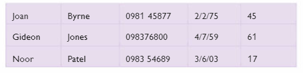
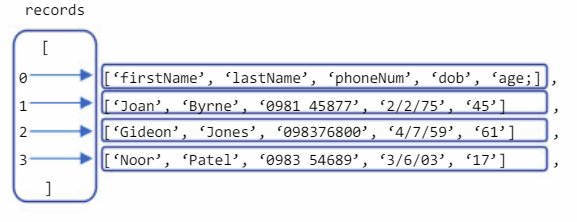
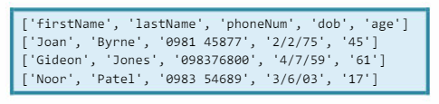

# Appending data to a .csv file 📚

We have now created `patients.csv` which is a flat file database with attributes labels _(headings)_.


## Task 2 👨🏽‍💻
Next thing to do is add the patient data shown below:


The code is very similar to the previous example, but this time you must create 3 lists _(one for each patient record)_, and append them to the ``patients.csv`` file.

<details>
<summary> 👀Hint - Sample Code </summary>

````py
# Hard code user data
record1 = ["Joan", "Byrne", "0981 45877", "2/2/75", "45"]
record2 = 
record3 = 

# Open the file for writing. Append "a" automatically adds a new line.
file = 
db =                     # Used to create a connection to patients.csv
db.writerow(record1)     # Writes the patient's data to the .csv file
.
.
file.close()             # Close the file afterwards

````
</details>

### 💡 Note:
The order of attributes is very important! They must match the order in `patients.csv`.

## Task 3 - Read and Display Data 👨🏽‍💻

Now I want you to read in a row from `patients.csv` and then display it in the console.

<details>
<summary> 👀 Hint </summary>
  
````py
# Reading and displaying the table from a .csv file
file = open("patients.csv", "r")

# Read the complete .csv file using "csv.reader(file)" function, then cast to a list.
                              # This line returns all records including headers.
file.close()
print( )
````

</details>


### 💡 Note:
The double square brackets ``[[ ]]`` at the start and end of the output indicate a **_List of Lists!_** 

- This is often referred to as a 2D-list.
  - In Python, a 2D-list is a 1D-list where each item in the list is a 1D-list itself..._"a list of lists."_
- The diagram below shows the ``records`` list.


  - Each item in the records list, contains a 1D-list that corresponds to a single patient record.
  - As the attribute labels are at index [0], the first patient record is at index [1] of the ``records`` list.

## Task 4 👨🏽‍💻 

Modify the code from Task 3, to print out each record as a 1D-list.

In other words, produce the following display:


