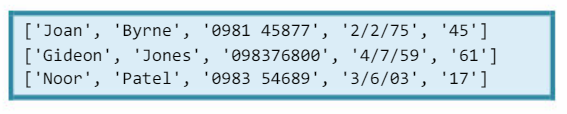
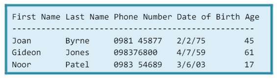

# Accessing & Processing Data 📚 

Now we need to explore how we can access and process specific data from our `patients.csv` file.

We know that the first line contains the attribute labels so we could choose to ignore those and not print them.

## Task 5 👨🏽‍💻 
Produce the following output, building on the code you used in Task 4.



<details>
<summary>👀 Hint </summary>

````py
# Choosing to ignore the Attribute Labels (headers), just print the data...

print() # print an empty line to create space between Tasks.
print("Print data without attributes:")

# Loop through .csv file, ignoring first index [0] - Attribute labels.
for record in records[:]:
.
.

````
  
</details>

## Task 6 👨🏽‍💻 
Now using the list index skills you are acquiring, can you complete the following:

- Display the patients' Date of Births.
- Display the patients' Ages.

<details>
<summary>👀 Hint </summary>

````py
record[3]
record[4]
````  
</details>

## Task 7 👨🏽‍💻 

For your final task, you are asked to display **_ALL_** the patient data in the following format, using string processing.



- Create your own attribute labels and **_do not_** include the labels from the `patient.csv` file which are in ``camelCase``.

<details>
<summary>👀 Hint </summary>

````py
print("First Name\t Last Name\t Phone Number\t Date of Birth\t Age")
print("-----------------------------------------------------------")
````
  
</details>

