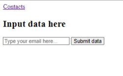

# Email Collector - Home Page 📚

Recalling the HTML & CSS skills you learned last year, I want you to re-create the following basic home page in `index.html`.

## Project Brief 📝👨🏽‍💻
1. Create a home page in `index.html` with the following attributes:
    
    - A `<h1>` heading.
    - An input box where users can enter their email address.
    - A button
    - A hyperlink to the second page of the website called `contacts.html`.
    - A `<title>` tab called `Data Input` 
3. You are to prompt the user to enter their Email Address into the text box shown above in `index.html`.
4. When the user clicks `Submit data`, their email address will be sent to a Firebase Database and stored there.
5. When you click on `Contacts`, you will be brought to a second page where all the email addresses will be displayed.
6. Your Firebase Database will send the data back to this page.

### (Go to next page...)

