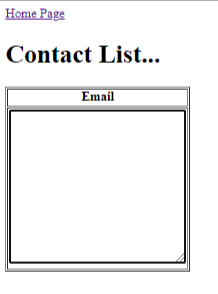

# Contact List 📚

Again, recalling the HTML & CSS skills you learned last year, I want you to re-create the following home page in `contacts.html`.

## Project Brief 📝👨🏽‍💻
1. Create a home page in `index.html` with the following attributes:
    
    - Another `<h1>` heading saying _"Contact List"_.
    - A table heading called Emails.
    - A `textarea` withing the table to dispaly the emails received from your Firebase DB.
    - A table border.
    - A hyperlink to the main page of the website `index.html`.
    - A `<title>` tab called `Contact List`

      
2. When you click on `Home Page`, you will be brought back to `index.html`.