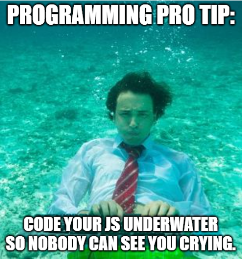
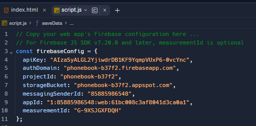

# Connecting to Firebase 📚


Firebase is a powerful platform developed by Google that provides a set of tools and services for building and managing web and mobile applications. It's designed to make it easier for developers to create high-quality applications without having to manage the underlying infrastructure.

Firebase offers us access to a Realtime Database.

Firebase provides a cloud-hosted NoSQL database that allows developers to store and synchronize data in real-time across connected clients. This is particularly useful for applications that require live updates and collaboration.

- Using the _"Firebase Setup"_ page in _"Content Library"_ in OneNote, I want you to follow the steps and create a Firebase Databade called ``Contact List``.

In this part of the tutorial we are going to explore the JavaScript code needed to link to our Firebase DB.


# What is JavaScript? 📚


JavaScript is a programming language that brings websites to life by making them interactive and dynamic. Imagine a website as a digital world where things happen when you click a button or move your mouse. JavaScript is like the magic behind those actions.

Let's break it down: when you visit a website, your browser (like Chrome or Firefox) uses HTML for structure and CSS for style. But these are like the skeleton and skin of the website. JavaScript is the brain that makes it smart.

Think of JavaScript as a set of instructions for your browser. It tells your browser what to do when you click a button, enter information in a form, or even when the page loads. For example, it can make pop-up messages, change the color of a button when you hover over it, or fetch new information from the internet without reloading the whole page.

Learning JavaScript is like gaining superpowers for the web. With it, you can build games, create interactive forms, and make websites that respond to what users do. It's a cool language to start with because it's everywhere on the web, and as you get better, you'll be able to make cooler and more complex things happen in the digital world.




## Method
1. Add the follwoing code beneath your closing HTML tag `</html>` in ``index.html`` and in ``contacts.html``.

````html
<!-- Include firebase.js here -->
<script src="https://www.gstatic.com/firebasejs/8.4.0/firebase.js"></script>

<!-- Include script.js here -->
<script src="script.js"></script>
````

2. We are goign to use `script.js` to code up the JavaScript needed to communicate with Firebase.
3. Copy and Paste the Firebase Configuration Key to the top of JS code.

  - For example



### 💡Note:
Each Firebase DB, has it own UNIQUE configuration key. Use the _"Firebase Setup"_ notes to help you with this step.

4. Next we want to Initialize Firebase
````js
// Initialize Firebase
firebase.initializeApp(firebaseConfig);
````

5. Now we need to retreive the Database handle and create a Root Node in the Project data tree. 
````js
// Retrieve the database handle (handle is a type of function)
const myDBCxn = firebase.database().ref('/Contacts');
//Contacts is the name of the root node in the project data tree.
````

<details>

<summary> 👀 More Information </summary>
Let's break down the provided code step by step:


1. `firebase`: This assumes that you have the Firebase SDK (Software Development Kit) included in your project. Firebase is a platform that offers various services, including a real-time database, authentication, and more.

2. `firebase.database()`: This part of the code is accessing the Firebase Realtime Database service. The `database()` function is a method provided by the Firebase SDK to get a reference to the database.

3. `.ref('/Contacts')`: This line is creating a reference to a specific location within the Firebase Realtime Database. The parameter `'/Contacts'` specifies the path to the location. In Firebase, data is organized in a tree-like structure, and here, it's indicating that the data is stored under the 'Contacts' node.

So, in summary, this code is establishing a connection to a specific node ('Contacts') within the Firebase Realtime Database. The `myDBCxn` variable now holds a reference to this location, and you can use it to perform various operations, such as reading or writing data under the 'Contacts' node in the database. 

This is the first step when interacting with the Firebase Realtime Database in a JavaScript application.
</details>

6. Now we want our button to run our ``saveData`` function when clicked.
````js
//Tell JavaScript to call saveData when SUBMIT button is clicked
const btn = document.getElementById("submit-data");
````

<details>

<summary> 👀 More Information </summary>

This code is obtaining a reference to an HTML element with the id "submit-data" using the ``document.getElementById`` method and storing it in a variable named `btn`. Let's break it down:

1. `document`: This represents the entire HTML document in a web page.

2. `.getElementById("submit-data")`: This is a method that searches the HTML document for an element with the specified id, in this case, "submit-data".

3. `const btn = ...`: The result of `getElementById("submit-data")` is assigned to a constant variable named `btn`.

So, this code is essentially selecting a button element in the HTML document with the id "submit-data" and creating a JavaScript reference to it. This is often done when you want to perform some action, like calling a function, when the button is clicked. In the context of our code, we want the function named `saveData` to be called when the button is clicked. 
</details>

7. We need to add an _"Event Listener"_ to our button `btn`. However we must ensure that the button exists before trying to attach an event listener to it.

````js
// Check if button is present to avoid type error, then add Event Listener
if (btn) {
  btn.addEventListener("click", saveData);
}
````
<details>

<summary>👀 More Information </summary>

In summary, this code is checking if the variable ``btn`` is defined and not null before attempting to add an event listener to it. 

This is a good practice to avoid errors if, for some reason, the button element is not found or doesn't exist in the HTML document. 

If ``btn`` is truthy, it means the button exists, and the event listener is added to handle the "click" event by calling the ``saveData`` function.
</details>

8. Now we call the function `saveData` so it will store the User's email in our Firebase DB.
````js
// Submit clicked so post the data to the Firebaase server
function saveData() {
  // Read the data from the Email Address field
  const eMail = document.getElementById("emailAddress");
  const eMailValue = eMail.value;
 

  // code to save the data to Firebase GOES HERE!
  const data = myDBCxn.push();
  data.set({emailAddress: eMailValue});
}
````
<details>
<summary>👀 More Information </summary>
Let's break down the provided code:

1. **Function Declaration:** This code defines a function named `saveData`. This function is associated with our submit button action.

2. **Reading Data from the Email Address Field:**
   - `const eMail = document.getElementById("emailAddress");`
      - This line retrieves a reference to an HTML element with the id "emailAddress," presumably an input field for an email address.
   - `const eMailValue = eMail.value;`
      - This extracts the current value entered into the email input field and stores it in the variable `eMailValue`.


3. **Firebase Data Saving:**
   - `const data = myDBCxn.push();`
     - This line creates a new reference within the Firebase Realtime Database under the "Contacts" node. The `push()` method generates a unique key for the new data.
   - `data.set({ emailAddress: eMailValue });`
     - This sets the value of the new data in the database. In this case, it's saving an object with a property named "emailAddress" and the value obtained from the email input field.

So in summary, when the `saveData` function is called, it reads the email address from an input field, creates a new reference in the Firebase Realtime Database under the **_"Contacts"_** node, and sets the email address value in the database. 

This is a common pattern for handling form submissions and storing data in a database, particularly in web applications using Firebase.
  
</details>

9. Retrieve and Display User data. It's important to note here that the term "child" refers to a piece of data being entered, in our case, a new email.
````js
// Code to retrieve and display the data goes here ...
myDBCxn.on("child_added", displayData);
````
<details>
<summary>👀 More Information </summary>
The code above  is setting up a listener for the "child_added" event on the Firebase Realtime Database reference (`myDBCxn`). When a new child is added to the specified location in the database, the `displayData` function will be called to handle the event.

Let's break it down:

1. **`myDBCxn`**: This is a reference to a location in the Firebase Realtime Database.

2. **`.on("child_added", displayData)`**: This line sets up a listener for the "child_added" event on the specified database reference (`myDBCxn`). The "child_added" event is triggered whenever a new child _(piece of data)_ is added to the specified location in the database.

3. **`displayData`**: This is the callback function that will be called when the "child_added" event occurs. The `displayData` function is expected to handle what happens when new data is added to the specified location in the database.

In practical terms, this code is preparing to react to new data being added to the specified Firebase Realtime Database node (`myDBCxn`). When a new child is added, the `displayData` function will be invoked, and it is expected to contain logic to handle how the new data should be displayed or processed in the application.

Typically, in the `displayData` function, you would retrieve the new data and update the user interface accordingly. 

again, this is a common pattern in real-time applications where data changes on the server, and you want the client to respond dynamically to those changes.
  
</details>

10. Retrieve the new data and update the user interface `contacts.html`with email addresses.
````js
// Retrieve the new data and update the user interface accordingly. 
function displayData(data, prevChildKey) {
    const datapoint = data.val();
    //info1 is the area in the table
    document.getElementById("info1").value += datapoint.emailAddress + "\n";
   
}
````

<details>
<summary> 👀 More information </summary>
  
The `displayData` function is designed to handle and display data when the "child_added" event is triggered in a Firebase Realtime Database reference. 
  
Let's break down the code:

1. **Function Declaration:** Defines a function named `displayData` that takes two parameters:
   - `data`: Represents the data that was added or changed.
   - `prevChildKey`: Represents the key of the previous child, which can be useful in ordered data sets.

2. **`const datapoint = data.val();`:** Extracts the value of the data using the `val()` method.

   The assumption here is that each child in the database is a key-value pair, and `datapoint` now holds the value of the data.

4. **`document.getElementById("info1").value += datapoint.emailAddress + "\n";`:**
   - `document.getElementById("info1")`
     - Retrieves an HTML element with the id "info1."
     - This is the textarea in our HTML form.
   - `.value += datapoint.emailAddress + "\n";`
     - Appends the email address value from the retrieved data (`datapoint.emailAddress`) to the current value of the element.
     - The addition of `\n` is to add a newline character after each email address, making each new entry appear on a new line.

In summary, when the `displayData` function is called in response to a "child_added" event in Firebase, it takes the data, extracts the email address from it, and appends the email address to the content of an HTML element with the id "info1." 
  
</details>

### Now click `RUN` and your interactive Website should link with your Firebase DB and display all your users' email addresses on your `contacts.html` page. 
