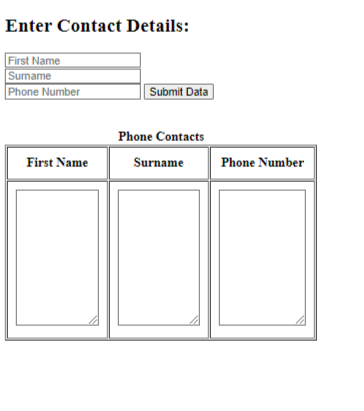

# Phone Book Website 📚

Recalling the HTML & CSS skills you have learned, I want you to re-create the following basic Phone Book Website in `index.html`.

## Project Brief 📝👨🏽‍💻
1. Create a home page in `index.html` with the following attributes:
    
    - A `<h1>` heading prompting the user to enter their Contact Details.
    - Input boxes where users can enter their
      - First Name
      - Surname
      - Phone Number
    - A button that they click when they want to submit their data.
    - A table heading called `Phone Contacts`.
      - A `textarea` within the table to dispaly the data received from your Firebase DB.
      - A table border.
    - A `<title>` tab called `Phone Contacts`

2. When the user clicks `Submit data`, their data will be sent to a Firebase Database called `Phone Book` and stored there.
3. Your Firebase Database will send the data back to this page and display it in the table.
4. Each time a new user enters their data, the Database and table will be updated.

### (Go to next page...)