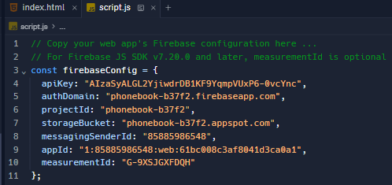

# Connecting to Firebase 📚

As we saw in _8.2 - Email Collector_, Firebase offers us access to a Realtime Database.

Firebase provides a cloud-hosted NoSQL database that allows developers to store and synchronize data in real-time across connected clients. This is particularly useful for applications that require live updates and collaboration.

- Using the _"Firebase Setup"_ page in _"Content Library"_ in OneNote, I want you to follow the steps and create a Firebase Databade called ``Phone Book``.

- In this part of the tutorial we are going to explore some new JavaScript code needed to link to our Firebase DB.


## Method

1. Add the following code beneath your closing HTML tag `</html>` in `index.html`.

````html
<!-- Include firebase.js here -->
<script src="https://www.gstatic.com/firebasejs/8.4.0/firebase.js"></script>

<!-- Include script.js here -->
<script src="script.js"></script>
````
2. We are goign to use `script.js` to code up the JavaScript needed to communicate with Firebase.
3. Copy and Paste the Firebase Configuration Key to the top of JS code as we did in the previous lesson.

  - For example


### 💡Note:
Each Firebase DB, has it own UNIQUE configuration key. Use the _"Firebase Setup"_ notes to help you with this step.

4. Next we want to Initialize Firebase
````js
// Initialize Firebase
firebase.initializeApp(firebaseConfig);
````

5. Now we need to retreive the Database handle and create a Root Node in the Project data tree. 
````js
// Retrieve the database handle (handle is a type of function)
const myDBCxn = firebase.database().ref('/Information');
//Information is the name of the root node in the project data tree.
````
<details>

<summary> 👀 More Information </summary>
Let's break down the provided code step by step:


1. `firebase`: This assumes that you have the Firebase SDK (Software Development Kit) included in your project. Firebase is a platform that offers various services, including a real-time database, authentication, and more.

2. `firebase.database()`: This part of the code is accessing the Firebase Realtime Database service. The `database()` function is a method provided by the Firebase SDK to get a reference to the database.

3. `.ref('/Information')`: This line is creating a reference to a specific location within the Firebase Realtime Database. The parameter `'/Information'` specifies the path to the location. In Firebase, data is organized in a tree-like structure, and here, it's indicating that the data is stored under the 'Information' node.

So, in summary, this code is establishing a connection to a specific node ('Information') within the Firebase Realtime Database. The `myDBCxn` variable now holds a reference to this location, and you can use it to perform various operations, such as reading or writing data under the 'Information' node in the database. 

This is the first step when interacting with the Firebase Realtime Database in a JavaScript application.
</details>

6. Now we want our button to run our ``saveData`` function when clicked.
````js
// Tell JavaScript to call saveData when SUBMIT button is clicked
const btn = document.getElementById("submit-data");
btn.addEventListener("click", saveData);
````

<details>

<summary> 👀 More Information </summary>

This code is obtaining a reference to an HTML element with the id "submit-data" using the ``document.getElementById`` method and storing it in a variable named `btn`. Let's break it down:

1. `document`: This represents the entire HTML document in a web page.

2. `.getElementById("submit-data")`: This is a method that searches the HTML document for an element with the specified id, in this case, "submit-data".

3. `const btn = ...`: The result of `getElementById("submit-data")` is assigned to a constant variable named `btn`.

So, this code is essentially selecting a button element in the HTML document with the id "submit-data" and creating a JavaScript reference to it. This is often done when you want to perform some action, like calling a function, when the button is clicked. In the context of our code, we want the function named `saveData` to be called when the button is clicked. 
</details>

7. Now we call the function `saveData` so it will store the User's data in our Firebase DB.
````js
// Submit clicked so post the data to the server
function saveData() {
  // Read the data from the first name field
  const fNameField = document.getElementById("firstName");
  const fNameFieldValue = fNameField.value;
 
  // Read the data from the last name field
  const lNameField = document.getElementById("lastName");
  const lNameFieldValue = lNameField.value;
 
   // Read the data from the age field
  const numField = document.getElementById("contactNumber");
  const numFieldValue = numField.value;

  // code to save the data to Firebase GOES HERE!
  const data = myDBCxn.push();
  data.set( {firstName: fNameFieldValue,lastName: lNameFieldValue,contactNumber: numFieldValue});
}

````

<details>
<summary>👀 More Information </summary>
The purpose of this function is to read data from several input fields in our HTML form, and then save this data to a Firebase Realtime Database.

Let's break down the code:

1. **Reading Form Data:**
   - Three sets of code retrieve values from three different input fields: "firstName," "lastName," and "contactNumber."
   - Each set consists of obtaining a reference to the input field using `document.getElementById` and then extracting its value.

2. **Firebase Data Saving:**
   - `const data = myDBCxn.push();`: Creates a new reference within the Firebase Realtime Database under the "Information" node.
   - The `push()` method generates a unique key for the new data.
   - `data.set({firstName: fNameFieldValue, lastName: lNameFieldValue, contactNumber: numFieldValue});`
     - Sets the value of the new data in the database. The data being saved is an object with properties for the first name, last name, and contact number, and the values are obtained from the corresponding input fields.

In summary, when the `saveData` function is called (in response to a form submission), it reads data from three input fields (first name, last name, and contact number), creates a new entry in the Firebase Realtime Database under the "Information" node, and sets the values in the database corresponding to the form input values.
  
</details>

8. _Retrieve, Display & Update_ the User's data for our Phone Book table in `index.html`.
    - Again, please note that the term "child" refers to a piece of data being entered, in our case, _first name, last name,_ and _contact number._

### 💡Note:
> You will need to finish coding this `displayData` Function for it to work properly!

````js
// Code to retrieve and display the data goes here ...
myDBCxn.on("child_added", displayData);

function displayData(data, prevChildKey) {
    const datapoint = data.val();
    //info1, info2, info3 are the text areas in the table.
    document.getElementById("info1").value += datapoint.firstName + "\n";
    document.getElementById("info2") . . . . . . . . 
    document. . . . . . . . . . . . . . . . . . . .
}
````

<details>
<summary>👀 More Information </summary>

This code is setting up a listener for the "child_added" event on a Firebase Realtime Database reference (`myDBCxn`). When a new child is added to the specified location in the database, the `displayData` function will be called to handle the event.
  
Let's break it down:

1. **Setting up the Event Listener:**
   - `myDBCxn.on("child_added", displayData);`
     - This line sets up a listener for the "child_added" event on the specified database reference (`myDBCxn`). The "child_added" event is triggered whenever a new child (piece of data) is added to the specified location in the database.

2. **`displayData` Function:**
   - `function displayData(data, prevChildKey) { ... }`
     - This is the callback function that will be called when the "child_added" event occurs.
     - It takes two parameters:
        - `data`: Represents the data that was added or changed.
        - `prevChildKey`: Represents the key of the previous child, which can be useful in ordered data sets.

3. **Extracting Data and Updating the UI:**
   - `const datapoint = data.val();`
     - Extracts the value of the data using the `val()` method. The assumption here is that each child in the database is a key-value pair, and `datapoint` now holds the value of the data.
      - The following lines update the values of three different areas in the table ("info1," "info2," and "info3") by appending the corresponding values from the retrieved data.
      - Each value is followed by a newline character (`\n`), likely to separate entries in the table.

In summary, when a new child is added to the specified location in the Firebase Realtime Database, the `displayData` function is called, extracting the data and updating the user interface by appending the values of the "firstName," "lastName," and "contactNumber" to different areas in the table. 

This is a common pattern for updating the UI in real-time applications based on changes in a Firebase Realtime Database.
  
</details>

### Now click `RUN` and your interactive "Phone Book Website" should link with your Firebase DB and display all your users' details on your `index.html` page. 


